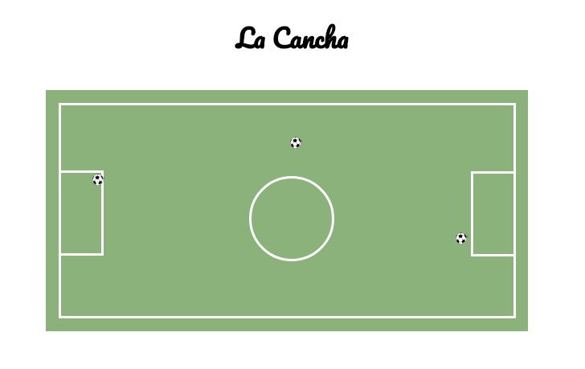

## LA CANCHA DE FUTBOL

La siguiente página web muestra el diseño de una cancha de fútbol diseñado en una hoja de estilos de CSS y HTML.

La posicion de cada elemento es **relative** lo que ha permitido ubicarlas según la posición de su elemento padre.
